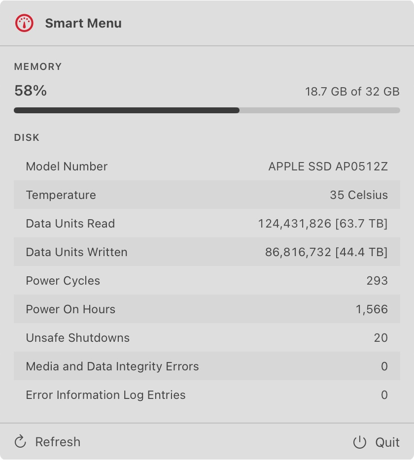

# Smart Menu

A minimal SwiftUI macOS menu bar app for system monitoring.



The menu bar shows a square gauge that fills with current memory usage. Clicking it opens a panel with:

- **Memory** — used / total and a live usage bar, refreshed every second.
- **Disk** — NVMe S.M.A.R.T. health: temperature, wear, data written, power-on hours, and more.

SMART data is read directly through IOKit — no external tools, no admin rights. The UI follows the system Light/Dark appearance automatically.

## Why memory?

Memory and SSD wear are linked. When memory usage climbs, macOS starts swapping pages to disk — and under memory pressure during intensive I/O tasks, that means more reads and writes hitting your SSD. Keeping an eye on memory is an early warning for the swap activity that adds to your drive's lifetime write count, which is exactly what the Disk section tracks.

## Build & run

```sh
make build     # build the app
make run       # build and launch
make install   # copy to /Applications and launch
make test      # run unit tests
```

## Requirements

- macOS 13+ (Apple Silicon or Intel with an NVMe drive).
- Xcode 16 to build.

## Notes

- The Disk section uses the NVMe SMART log via IOKit (`IONVMeSMARTInterface`); the Disk section is empty on Macs without an NVMe drive.
- The app runs unsandboxed, so it is distributed outside the Mac App Store as a notarized DMG (`make dmg`).

## License

[MIT](LICENSE)
